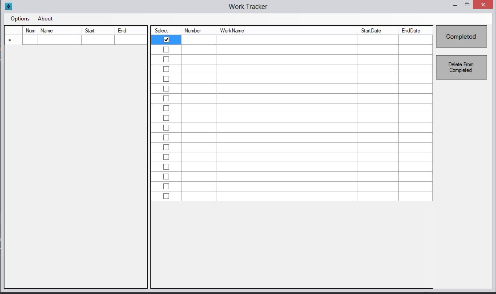

# WorkTracker
<ul>
  <li>WorkTracker will save all yout work todo list and finished list</li>
  <li>Saved data will be saved in the path where the application being executed</li>
  <li>We can move the completed daily works to completed in just one click</li>
  <li>The datas will automatically be saved when closing tha WorkTracker
</ul>

